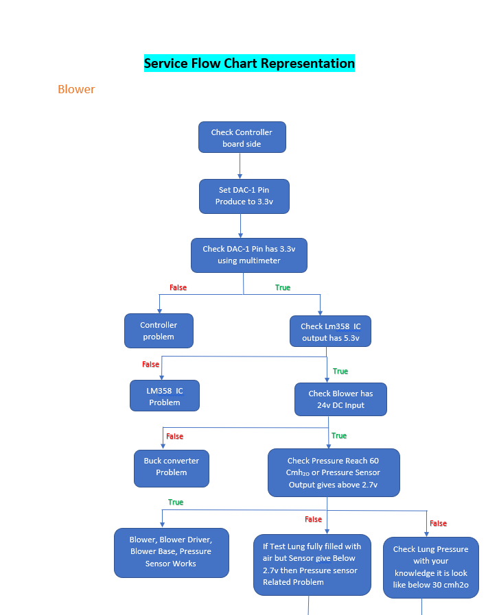
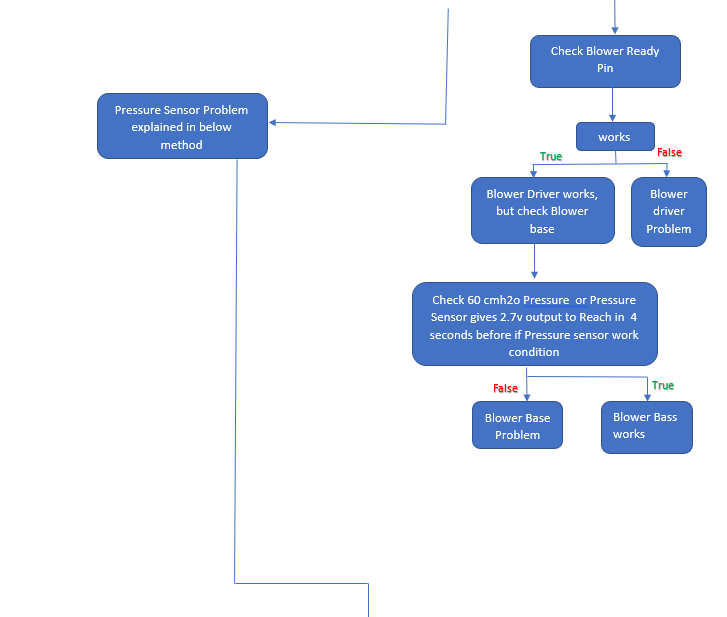

# Jeevan_Lite
 ventilator
 

```c
void maxim_max1726x_wait_dnr(void)
{
	maxim_max1726x_read_reg(MAX1726X_FSTAT_REG, &max1726x_regs[MAX1726X_FSTAT_REG]);
	vTaskDelay(10);
	while((max1726x_regs[MAX1726X_FSTAT_REG] & 0x0001) == 0x0001)
	{
		vTaskDelay(10);
		maxim_max1726x_read_reg(MAX1726X_FSTAT_REG, &max1726x_regs[MAX1726X_FSTAT_REG]);
	}
	vTaskDelay(10);
}
```

```c
/* This code belongs in ble_cus.h*/

/**@brief Custom Service structure. This contains various status information for the service. */
struct ble_cus_s
{
    uint16_t                      service_handle;                 /**< Handle of Custom Service (as provided by the BLE stack). */
    ble_gatts_char_handles_t      custom_value_handles;           /**< Handles related to the Custom Value characteristic. */
    uint16_t                      conn_handle;                    /**< Handle of the current connection (as provided by the BLE stack, is BLE_CONN_HANDLE_INVALID if not in a connection). */
    uint8_t                       uuid_type; 
};
```



